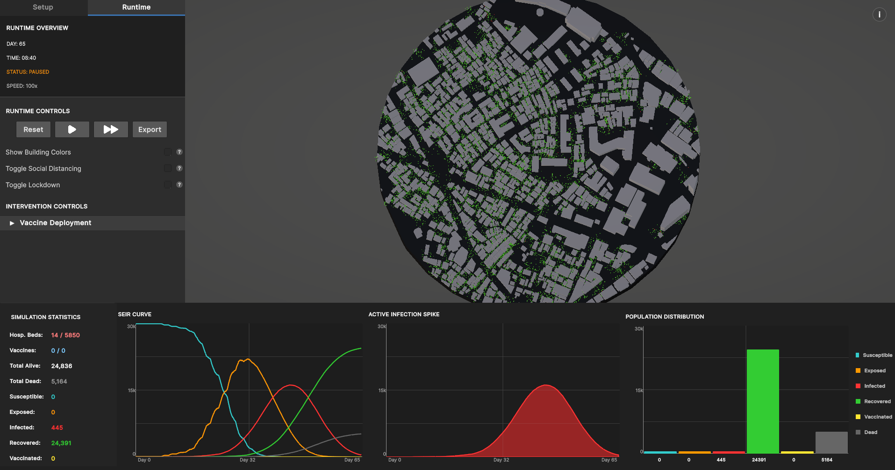

# Mildern - An Interactive 3D Epidemic Simulation Tool



An advanced, highly scalable agent-based epidemiological simulator built in Unity. 

Unlike traditional equation-based models (which treat a population as a single averaged math equation), this system simulates every individual in the city as a living, breathing entity with their own schedule, personality, compliance score, workplace, home, and daily routine. This enables the observation of complex emergent phenomena such as silent super-spreaders, lockdown fatigue, hospital overflow, and vaccine hesitancy.

## Key Features

*   **Massive Scale via Unity Job System:** Simulates tens of thousands of individual agents simultaneously at 60 FPS by decoupling visual rendering from heavy mathematical calculations.
*   **The Compliance Engine:** Agents are not a hivemind. Every agent rolls a permanent, hidden "Compliance Score" (0.0 to 1.0) at birth dictating whether they obey lockdowns, self-quarantine, or queue for vaccines.
*   **SEIRD Virus Model:** Utilizes a Susceptible, Exposed, Infected, Recovered, Dead (SEIRD) framework with granular controls over incubation periods, transmission rates, and immunity decay.
*   **Spatial Partitioning & Indoor Mechanics:** 
    *   *Outdoors:* Uses a highly optimized mathematical grid to calculate virus transmission distances dynamically.
    *   *Indoors:* Agents transition into building-specific hash maps with unique transmission multipliers and contact caps.
*   **3-Tier Medical Triage:** Sick agents independently decide whether to seek hospital care, self-quarantine at home, or ignore their symptoms based on their compliance profile.
*   **Timeline Scrubbing & Branching:** The simulation saves daily snapshots. Users can pause, scrub backwards through the data graph, alter a policy, and create a "Ghost Timeline" to compare alternate outcomes.
*   **1-Year Hardcap:** Scenarios are definitively capped at 365 in-game days to provide a structured testing window and prevent memory leak bloat.

## Tech Stack

* [![Unity][Unity-badge]][Unity-url]
* [![C#][CSharp-badge]][CSharp-url]
* [![Unity Job System][JobSystem-badge]][Unity-url]
* [![Burst Compiler][Burst-badge]][Unity-url]
* [![UI Toolkit][UIToolkit-badge]][Unity-url]

## System Architecture

The engine is built around a decoupled **Two-Tick System**:

1.  **Visual Ticks (Every Frame):** The Unity main thread is purely responsible for interpolating agent positions and drawing them on screen. 
2.  **Epic Ticks (Calculations):** The heavy logic (schedule changes, pathfinding, virus distance checks) runs on a staggered interval. The work is divided into independent Jobs (`ScheduleUpdateJob`, `EpidemicJob`, `UpdateGridJob`) and fired across all available CPU cores.

## Getting Started

Whether you just want to run the simulation or dive into the code, follow the paths below.

### For Users (Play the Simulation)
If you simply want to run the simulation and test scenarios without installing a game engine, you can download the pre-compiled standalone version.

1. Navigate to the **[Releases](../../releases)** tab on the right side of this repository.
2. Download the latest `.zip` file for your operating system (Windows/macOS/Linux).
3. Extract the folder to your computer.
4. Run the `Mildern.exe` executable file to launch the program.

### For Developers (Build from Source)
If you want to modify the simulation, tweak the math, or add new features, you will need to build the project from the source code.

**Prerequisites:**
* Unity 2021.3 LTS (or newer)
* Burst Compiler & UI Toolkit packages (installable via Unity Package Manager)

**Installation:**

1. Clone the repository:
   ```bash
   git clone https://github.com/ronjefferson/mildern.git
   ```

2. Open **Unity Hub** and click `Add project from disk`.
3. Select the folder `mildern`.
4. Open `SimCore_P.unity` in the `Assets/Scenes` folder.
5. Press the **Play** button in the Unity Editor to start testing.

## Dashboard Controls

The UI dashboard provides real-time control over the macro and micro variables of the simulation:

*   **Virus & Logistics:** Adjust Transmission Rates, Infection Radii, Recovery/Mortality, and Vaccine Deployment (Supply, Efficacy, Public Abidance).
*   **Societal Behavior:** Toggle Lockdowns, Social Distancing rules, and manage the ratio of Non-Workers vs. Workers to control daytime density.
*   **Medical System:** Manage Hospitalization Abidance thresholds and hard limits on Hospital Beds.

## Known Compromises & Limitations

*   **Abstracted Pathfinding:** To support 10,000+ agents without CPU bottlenecks, agents navigate via straight lines between pre-baked zone waypoints and use mathematical radii to simulate wandering.
*   **No Age Demographics:** The current model uses a flat mortality rate and does not disproportionately affect elderly agents.
*   **Single-City Model:** The simulation occurs in a closed system. There is no inter-region travel or external importation of cases after Day 0.

---

<!-- MARKDOWN LINKS & IMAGES -->
[Unity-badge]: https://img.shields.io/badge/Unity-100000?style=for-the-badge&logo=unity&logoColor=white
[Unity-url]: https://unity.com/
[CSharp-badge]: https://img.shields.io/badge/C%23-239120?style=for-the-badge&logo=c-sharp&logoColor=white
[CSharp-url]: https://docs.microsoft.com/en-us/dotnet/csharp/
[JobSystem-badge]: https://img.shields.io/badge/Unity_Job_System-535353?style=for-the-badge&logo=unity&logoColor=white
[Burst-badge]: https://img.shields.io/badge/Burst_Compiler-005C9E?style=for-the-badge&logo=unity&logoColor=white
[UIToolkit-badge]: https://img.shields.io/badge/UI_Toolkit-4C4C4C?style=for-the-badge&logo=unity&logoColor=white
